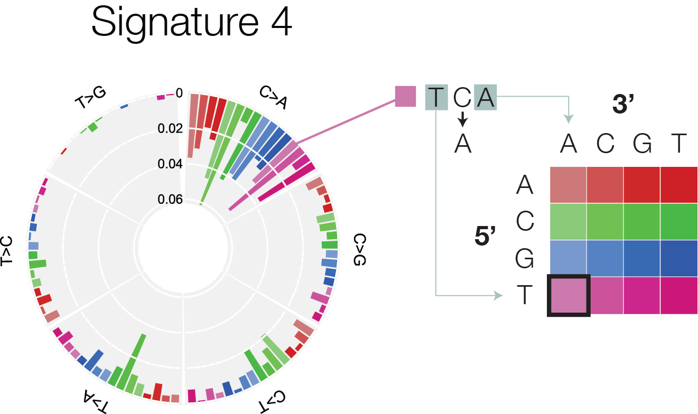
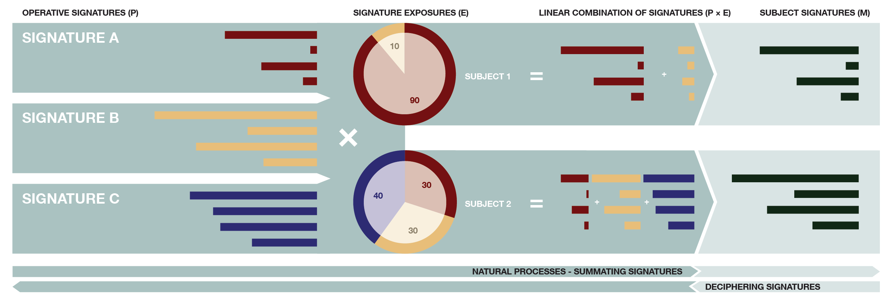

```{r setup, include=FALSE}
knitr::opts_chunk$set(echo = TRUE, message=FALSE)
```

# Things to Install

```
install.packages('tidyverse')
install.packages('nnls')
install.packages('cowplot')

## try http:// if https:// URLs are not supported
source("https://bioconductor.org/biocLite.R")
biocLite("TCGAbiolinks")
biocLite("BSgenome")
biocLite("BSgenome.Hsapiens.UCSC.hg38")

if (!require(devtools)) {
  install.packages("devtools")
  library(devtools)
}
install_github("eyzhao/SignIT", recompile = TRUE, build_vignettes = FALSE)
```

# Background

A hallmark characteristic of cancers is their high burden of somatic mutations. Tumours of different types have been shown to exhibit wildly different mutation rates. And there is significant diversity even within a single cancer type.


Somatic mutations can arise from a variety of overlapping mechanisms. Some examples include:

1. Exogenous mutagens
  - Cigarette smoke
  - UV Radiation
  - Chemical agents and toxins (i.e. aflatoxin, temozolomide)
2. Endogenous mutagenic processes
  - deamination of methyl-cytosines to thymines
  - reactive oxygen species forming DNA lesions which are mis-repaired by translesion synthesis
3. Loss of DNA repair pathways
  - base excision & nucleotide excision repair
  - mismatch repair
  - homologous recombination deficiency and non-homologous end joining

Each of these mechanisms gives rise to a unique pattern of somatic mutation. **Mutation signatures** characterize these patterns. A simple example of a mutation signature is the frequencies of each type of base change (C>A, C>T, C>G, T>A, T>C, T>G). The 12 possible base changes are often condensed down to six by grouping reverse complement pairs.

Additionally, the 3' and 5' trinucleotide context are incorporated. There are 4 possible bases upstream of a mutation, and 4 possible bases downstream, making for 4 * 4 * 6 = 96 possible mutation classes. This is the most common way to classify mutations for mutation signature analysis. See the below figure for an example visualization of these 96 classes.



# Exploring the catalogue of known mutation signatures

We will begin our exploration of mutation signatures by understanding the **generative process**. This means that we will learn how to simulate a cancer genome using known mutation signatures as a way to better appreciate the signature modeling process.

The most authoritative set of mutation signatures discovered from cancers is currently at COSMIC (http://cancer.sanger.ac.uk/cosmic/signatures). We can download them with the following code.

```{r load_cosmic_signatures}
library(tidyverse)

cosmic_signatures_raw = read_tsv('http://cancer.sanger.ac.uk/cancergenome/assets/signatures_probabilities.txt')

glimpse(cosmic_signatures_raw)
```

You may notice right away that some cleaning needs to happen before we can make use of these signatures. This is where the tidyverse, especially `tidyr` and `dplyr`, come into play.

There are 4 goals in this next block of code:

1. **Simplify the column specifying mutation type.** Currently, there are three columns with redundant information. Notice that the `Somatic Mutation Type` contains all that we need to know. So let's keep that, and rename it `mutation_type`.
2. **Put the data in long format.** Long format data is easier to manage, and allows you to encode an arbitrary number of dimensions. This follows the tidy-data principle of one observation per line.
3. **Remove columns x34, x35, x36, etc.** These seem to be cause by extra whitespace in the data. You'll see that once the data is in long format, it will be trivially easy to trim these columns off in a single command.
4. **Put signatures in proper numeric order and convert probabilities to numeric type.** Signatures will tend to get ordered by character rank. We need to restore numeric rank.
5. **Make sure that all signatures add up to 1*. In principle, this should already be the case, but it's always good to be paranoid when working with other people's data.

```{r tidy_cosmic_signatures}
cosmic_signatures <- cosmic_signatures_raw %>%
  select(-`Substitution Type`, -Trinucleotide) %>%      # Goal 1
  rename(mutation_type = `Somatic Mutation Type`) %>%
  gather(signature, probability, -mutation_type) %>%    # Goal 2
  filter(! is.na(probability)) %>%                      # Goal 3
  mutate(
    signature = factor(                                 # Goal 4
      signature, 
      levels = paste('Signature', 1:30)
    ),
    probability = as.numeric(probability)
  ) %>% 
  group_by(signature) %>%                               # Goal 5
  mutate(probability = probability / sum(probability)) %>%
  ungroup()

print(head(cosmic_signatures))
```

Now that the data are tidy, let's proceed to simulate a set of somatic mutations. The generative process has two steps:

1. **Select a signature**. Choose the signature using a probability vector **e**. This is known as the "exposures" vector, and it gives the relative contribution of each signature to the cancer.
2. **Select a mutation type**. Once you've selected a signature, the mutation type can be chosen simply by using the probabilities in the `cosmic_signature` tibble.

Let's simulate a cancer with 1000 somatic mutations. Let's imagine that our cancer is made up 40% from signature 2, 40% from signature 8, and 20% from signature 1. Starting with step 1, we randomly sample 1000 signatures based on these probabilities.

```{r sample_signatures, fig.height = 3, fig.width = 3}
signature_names <- cosmic_signatures$signature %>% levels
n_mutations <- 1000

sampled_signatures <- sample(
  x = signature_names,
  size = n_mutations,
  replace=TRUE,
  prob= c(
    0.2,
    0.4,
    0,
    0,
    0,
    0,
    0,
    0.4,
    rep(0, 22)
  ))

tibble(signature = sampled_signatures) %>%
  ggplot(aes(
    x = signature
  )) +
  geom_bar()
```

Next, we sample 1000 mutation types, one for each mutation.

```{r sample_mutation_types}
sample_mutation_type <- function(signature) {
  sapply(signature, function(signature_name) {
    with(
      cosmic_signatures %>% filter(signature == signature_name),
      sample(
        x = mutation_type,
        size = 1,
        replace = TRUE,
        prob = probability
      )
    )
  })
}

sampled <- tibble(signature = sampled_signatures) %>%
  mutate(
    mutation_type = sample_mutation_type(signature)
  )

head(sampled)
```

# The Mutation Counts Vector

Now that we have a set of 1000 simulated mutations, it's time to construct the mutation count vector, also know as the mutation catalog. This simply involves summing up our data according to mutation type. We can do this with dplyr's `group_by` and `summarise` commands.

```{r simulated_mutation_catalog}
bases = c('A', 'C', 'G', 'T')
substitution = c('C>A', 'C>G', 'C>T', 'T>A', 'T>C', 'T>G')

all_mutation_types <- tidyr::crossing(
  five_prime = bases,
  base_change = substitution,
  three_prime = bases
) %>%
  mutate(
    mutation_type = sprintf('%s[%s]%s', five_prime, base_change, three_prime)
  ) %>%
  select(mutation_type)

mutation_catalog <- sampled %>%
  group_by(mutation_type) %>%
  summarise(count = n()) %>%
  ungroup() %>%
  right_join(all_mutation_types, by = 'mutation_type') %>%
  replace_na(list(count = 0))
```

Now, we can plot the resulting catalog to see if it indeed looks like a mixture of signatures 1, 2, and 8. For this, we can use `ggplot`.

```{r plot_catalog, fig.width = 12, fig.height = 3}
mutation_catalog %>%
  mutate(
    substitution = gsub('.\\[(.>.)\\].', '\\1', mutation_type),
    context = gsub('(.)\\[.>.\\](.)', '\\1\\2', mutation_type)
  ) %>%
  ggplot(aes(
    x = context,
    y = count
  )) +
  geom_bar(stat = 'identity') +
  facet_grid(. ~ substitution) +
  theme(
    axis.text.x = element_text(angle = 90, hjust = 1, vjust = 0.5, size = 7)
  )
```

# De Novo Mutation Signatures

The most common approach for mutation signature analysis is called non-negative matrix factorization (NMF). For a visual explanation, see the diagram below.

What we have been doing so far (simulating a mutation catalog) is moving from left to right. We are taking operative mutation signatures, take a linear combination of them using the signature exposures as proportions, then draw mutations from the resulting probability distribution.



NMF is a way to move from right to left on this diagram. It involves using a set of mutation catalogs to simultaneously infer a set of signatures and exposures. This approach is also referred to as *de novo* mutation signature analysis because it infers a new set of mutation signatures. NMF is computationally intensive and the standard approach is implemented in Matlab, and is beyond the scope of this tutorial.

The NMF method is described in detail by [Alexandrov et al. (2013)](http://www.cell.com/cell-reports/abstract/S2211-1247(12)00433-0). There are a few alternatives implemented in R that use Bayesian methods named SigneR [(Rosales et al. 2017)](https://www.ncbi.nlm.nih.gov/pubmed/27591080) and [SignatureAnalyzer](http://archive.broadinstitute.org/cancer/cga/msp).

What we will outline in this tutorial is how to fit an individual mutation catalog to a set of know mutation signatures, namely the COSMIC signature set that we downloaded earlier.

# Fitting Mutation Catalogs to Known Signatures

The simplest n-of-1 analogue to NMF is called non-negative least squares (NNLS). It is called least squares because the aim is to find the signature proportions which best minimize the squared error between the data (the mutation catalog) and the modeled signatures and exposures.

To run NNLS, we will use the use the `nnls` package. If it's not installed, you can run `install.packages('nnls')` to install it from CRAN.

```{r}
library(nnls)
```

NNLS solves the linear algebra problem **Se** = **m**, where **S** (reference signature matrix) and **m** (mutation catalog) are known and **e** (exposures) are the unknown to solve for.

The first step is to build our reference signature matrix. This needs to be in wide form, then converted to a numeric matrix. The mutation_type column must be removed first.

```{r reference_signature_matrix}
cosmic_signature_matrix <- cosmic_signatures %>%
  spread(signature, probability) %>%
  select(-mutation_type) %>%
  as.matrix

print(head(cosmic_signature_matrix))
```

Next we need to extract the mutation count vector, and ensure that mutations types are ordered the same way as the reference signature matrix. The easiest way to do this is perform a join.

```{r simulated_order_mutation_catalog}
mutation_count_vector <- cosmic_signatures %>%
  spread(signature, probability) %>%
  left_join(mutation_catalog, by = 'mutation_type') %>%
  .$count

print(mutation_count_vector)
```

Now we can run the `nnls` function to extract exposures.

```{r simulated_nnls_exposures}
print(nnls(cosmic_signature_matrix, mutation_count_vector))

exposures <- tibble(
  signature = factor(
    colnames(cosmic_signature_matrix),
    levels = colnames(cosmic_signature_matrix)
  ),
  exposure = nnls(cosmic_signature_matrix, mutation_count_vector)$x
)

exposures %>%
  ggplot(aes(
    x = signature,
    y = exposure
  )) +
  geom_bar(stat = 'identity') +
  coord_flip()
```

Note that this has correctly recalled the signature proportions which we provided while simulating. However, there is some aberrant elevation of other signatures due to overfitting the mutation signature categorical noise profile. This is referred to as mutation signature bleed, and often causes transfer of signal between similar signatures.


# Analyzing mutation signatures from a VCF or MAF

We will next analyze some data from TCGA. To do this, we will need to first download the TCGA MAFs. A Bioconductor package called `TCGAbiolinks` helps to facilitate this. You can install it with the following commands.

```
## try http:// if https:// URLs are not supported
source("https://bioconductor.org/biocLite.R")
biocLite("TCGAbiolinks")
```

```{r tcga_download}
library(TCGAbiolinks)

maf <- GDCquery_Maf("CHOL", pipelines = "muse") %>%
  select(
    Chromosome, 
    Start_Position,
    End_Position,
    Reference_Allele,
    Tumor_Seq_Allele2,
    Tumor_Sample_Barcode
  ) %>%
  filter(
    End_Position - Start_Position == 0
  )

head(maf)
```

```{r summarise_tcga_data}
maf %>%
  group_by(Tumor_Sample_Barcode) %>%
  summarise(n_mutations = n()) %>%
  arrange(-n_mutations)
```

The next step requires installing `BSgenome` and `BSgenome.Hsapiens.UCSC.hg38` from Bioconductor.

```{r mutation_catalog}
library(BSgenome)
genome = getBSgenome("BSgenome.Hsapiens.UCSC.hg38")

sample_maf <- maf %>%
  filter(Tumor_Sample_Barcode == 'TCGA-W5-AA39-01A-11D-A417-09')
```

Next, we will retrieve trinucleotide context from the hg38 genome.

```{r compute_mutation_types}
sample_maf_annotated <- sample_maf %>%
  mutate(
    trinucleotide = getSeq(
      genome,
      Chromosome,
      Start_Position - 1,
      Start_Position + 1
    ) %>% as.character,
    genome_ref = substr(trinucleotide, 2, 2)
  )

print(head(sample_maf_annotated))
```

We will now confirm reference base matches the reference types we got from hg38.

```{r check_reference}
all(sample_maf_annotated$Reference_Allele == sample_maf_annotated$genome_ref)
```

Now that we have the trinucleotide column, we can determine the 96 mutation types, then determine the mutation catalog like we did before.

```{r tcga_mutation_types}
tcga_mutation_catalog <- sample_maf_annotated %>%
  mutate(
    mutation_type = sprintf(
      '%s[%s>%s]%s',
      substr(trinucleotide, 1, 1),
      Reference_Allele,
      Tumor_Seq_Allele2,
      substr(trinucleotide, 3, 3)
    )
  ) %>%
  group_by(mutation_type) %>%
  summarise(count = n()) %>%
  ungroup() %>%
  right_join(all_mutation_types, by = 'mutation_type') %>%
  replace_na(list(count = 0))
```

Next we can plot the TCGA mutation catalog. This time, we use a predefined function called `plot_snv_signature` which is provided in this repository. It provides colouring of the mutation contexts.

We also plot a nifty 2D legend of the mutation contexts, and combine the two figures with `plot_grid` from the `cowplot` library. This library is the best way I've found to combine multiple ggplot figures into a single plot. More information at https://cran.r-project.org/web/packages/cowplot/vignettes/plot_grid.html.

```{r tcga_plot_mutation_catalog, fig.width = 8, fig.height = 2.5}
source('plot_signature.R')
library(cowplot) # provides the plot_grid function for combining ggplot objects.

tcga_catalog_plot <- tcga_mutation_catalog %>%
  dplyr::rename(proportion = count) %>%
  plot_snv_signature()

signature_colours <- hsv(h = sort(rep(c(0, 0.3, 0.6, 0.9), 4)),
                         s = rep(c(0.1, 0.2, 0.5, 1), 4),
                         v = rep(c(0.8, 0.8, 0.8, 0.8), 4))

context_levels <- paste(c(rep('A', 4), rep('C', 4), rep('G', 4), rep('T', 4)),
                        rep(c('A', 'C', 'G', 'T'), 4))

colour_df <- data.frame(
  five_prime = c(rep('A', 4), rep('C', 4), rep('G', 4), rep('T', 4)),
  three_prime = rep(c('A', 'C', 'G', 'T'), 4),
  status = factor(1:16, levels=1:16),
  colour = signature_colours
)

snv_context_legend_plot <- ggplot(colour_df) +
  labs(x = "5' context", y = "3' context") +
  geom_tile(aes(x = five_prime, y = three_prime, fill = status), height = 0.9, width = 0.9) +
  scale_fill_manual(values = as.character(colour_df$colour)) +
  theme(legend.position = 'none',
        axis.ticks.x = element_blank(),
        axis.line.x = element_blank(),
        axis.ticks.y = element_blank(),
        axis.line.y = element_blank()
        )

plot_grid(
  tcga_catalog_plot,
  snv_context_legend_plot,
  nrow = 1, rel_widths = c(2.2, 1)
)
```

We can reuse some code from before to get the ordered count vector.

```{r order_mutation_catalog}
tcga_mutation_count_vector <- cosmic_signatures %>%
  spread(signature, probability) %>%
  left_join(tcga_mutation_catalog, by = 'mutation_type') %>%
  .$count

print(tcga_mutation_count_vector)
```

Now we can run the `nnls` function to extract exposures.

```{r nnls_exposures}
print(nnls(cosmic_signature_matrix, tcga_mutation_count_vector))

tcga_exposures <- tibble(
  signature = factor(
    colnames(cosmic_signature_matrix),
    levels = colnames(cosmic_signature_matrix)
  ),
  exposure = nnls(cosmic_signature_matrix, tcga_mutation_count_vector)$x
)

tcga_exposures %>%
  ggplot(aes(
    x = signature,
    y = exposure
  )) +
  geom_bar(stat = 'identity') +
  coord_flip()
```

# Mutation Signature Exposures with SignIT

To address some of the limitations of NNLS, we devised a mutation signature package called `SignIT`, available from https://github.com/eyzhao/SignIT. SignIT uses Markov Chain Monte Carlo to provide a Bayesian solution, which offers a number of benefits over NNLS

1. Plotting of mutation signature exposure posteriors - provides a complete estimate of signature exposures along with the distribution of credible solutions. This essentially provides confidence intervals on the signature estimate.
2. Plotting of mutation signature bleed - As mentioned earlier, mutation signature bleed can sometimes cause aberrant elevation of certain exposures. SignIT allows visualization of mutation signature bleed interactions for better interpretability.

A complete guide to SignIT is available from the [Vignette](https://eyzhao.github.io/SignIT/vignette.html).

SignIT accepts mutation catalog input in the same format as we set up before. Let's begin with the simulated catalog. We will plot the exposures with full posterior estimates and signature bleed.

```{r simulated_signit_exposures, fig.width = 6, fig.height = 5}
library(signit)
library(ggraph)

simulated_exposures <- mutation_catalog %>%
  get_exposures(n_cores = 1)

plot_exposure_posteriors_bleed(simulated_exposures)
```

And now we'll plot the TCGA exposures.

```{r tcga_signit_exposures, fig.width = 6, fig.height = 5}
tcga_exposures <- tcga_mutation_catalog %>%
  get_exposures(n_cores = 1)

plot_exposure_posteriors_bleed(tcga_exposures)
```

# Next Steps

The next step is to extend this to the analysis of *de novo* mutation signatures. The method by [Alexandrov et al. (2013)](http://www.cell.com/cell-reports/abstract/S2211-1247(12)00433-0) is implemented in Matlab. In my experience, the easiest way to run this in a pipeline is to output mutation catalogs from R using the package `R.matlab`.

As previously mentioned, it is also worth trying the alternatives coded in R:
  - SigneR [(Rosales et al. 2017)](https://www.ncbi.nlm.nih.gov/pubmed/27591080)
  - [SignatureAnalyzer](http://archive.broadinstitute.org/cancer/cga/msp).
  
Perhaps we can cover some of these tools in a future tutorial.